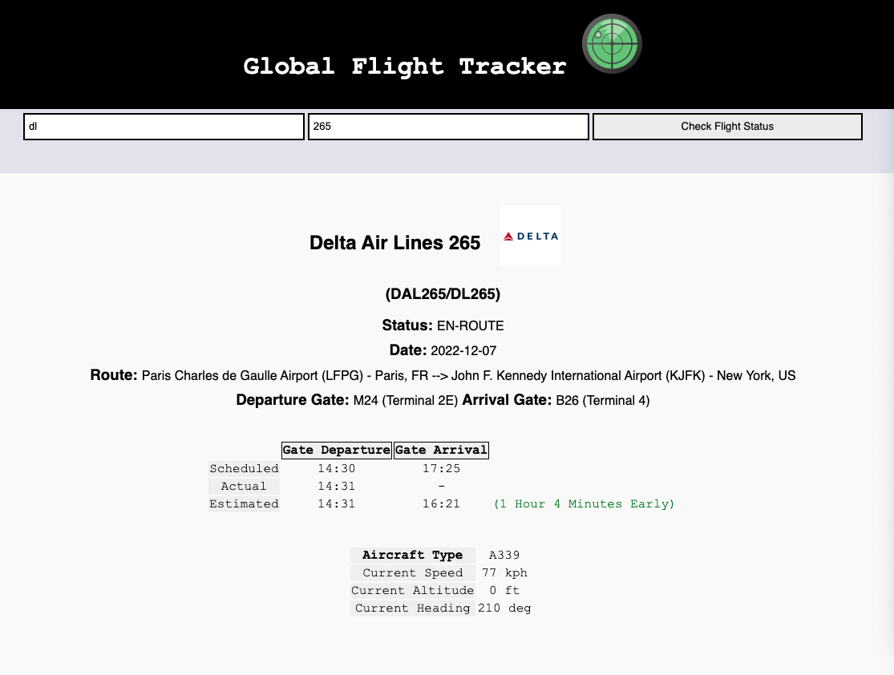
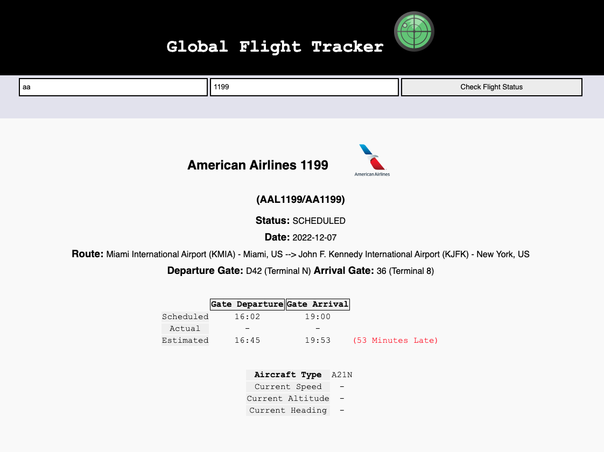

# Flight Tracker
Tracks airborne and scheduled flights using the AirLabs.co API.

Provides key flight information and calculates if the flight is early, on-time, or delayed based on API information.

### Technologies Used
* HTML 5
* CSS3
* JavaScript
* jQuery
* Google Fonts
* AirLabs.co API

### Screenshots

### Getting Started
Enter your flight's airline (IATA code) and flight number in the search box and click "Check Flight Status" to view flight details.

[Click Here](https://maydayjimmy.github.io/Flight-Tracker-1/) to go to the deployed app

### Future Enhancements
* Live updating dropdown menu of airline names in the search bar
* Pin location of current flight on a map using lat/long
* Display arrived flights